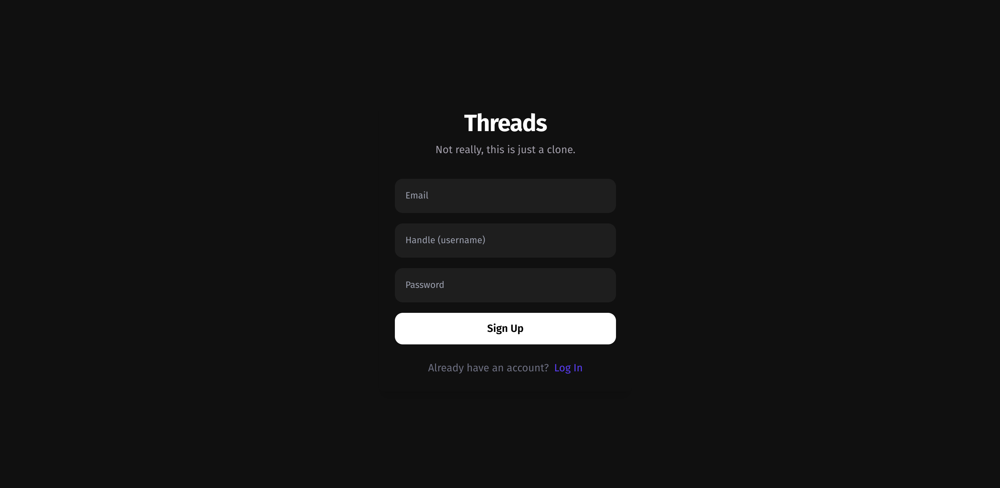
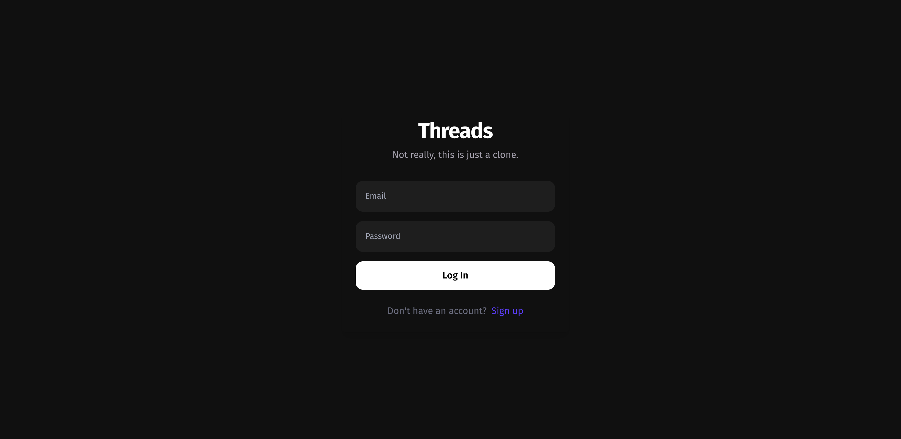
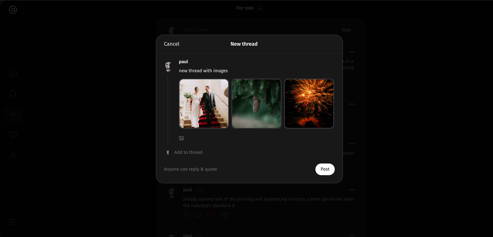
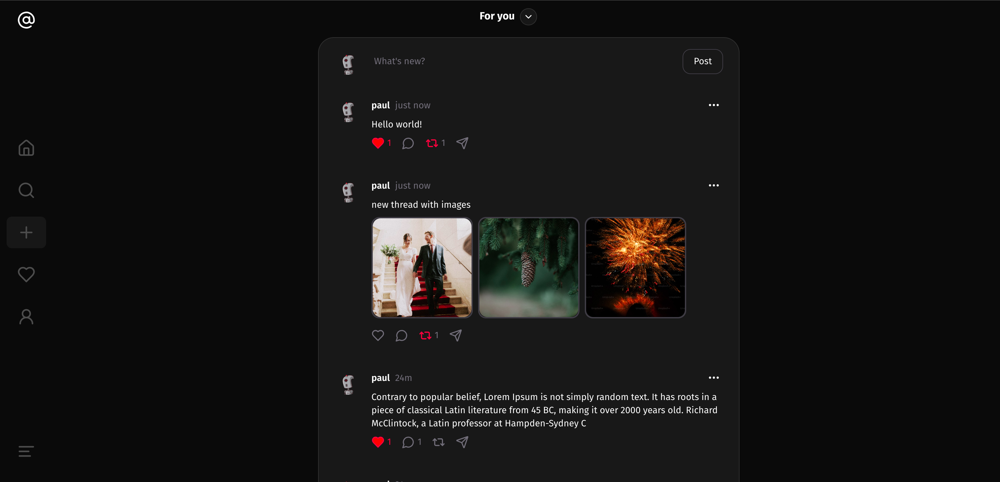
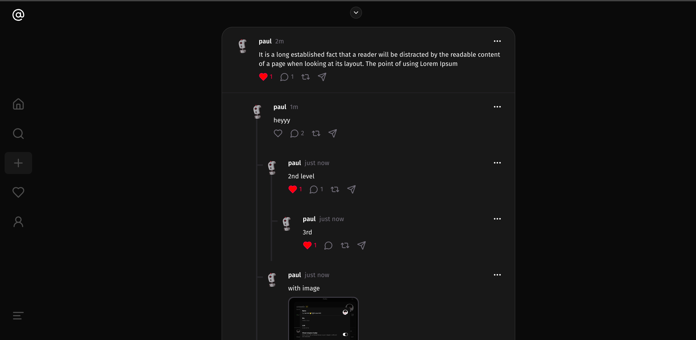
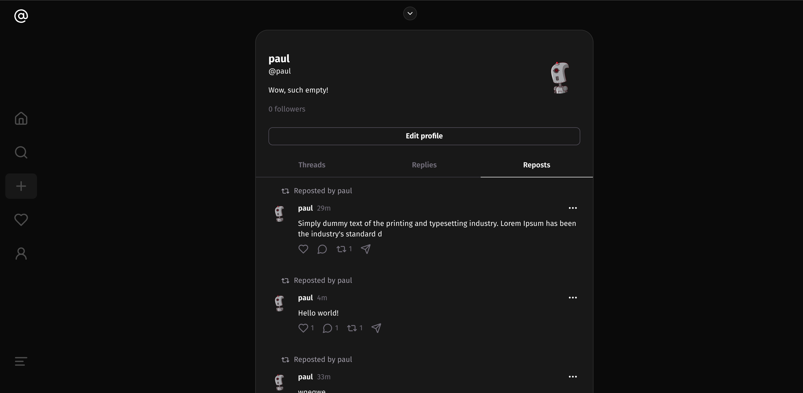
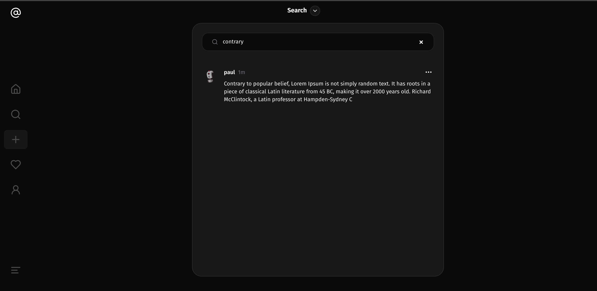
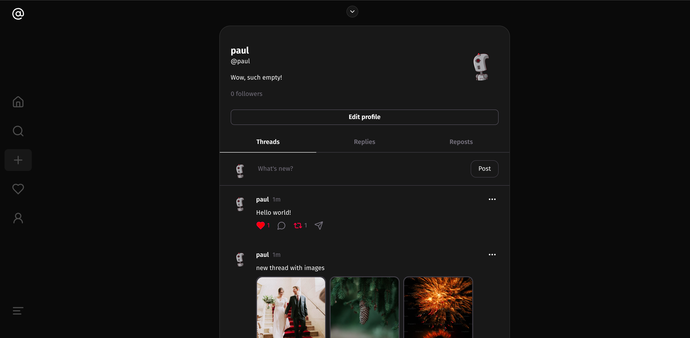
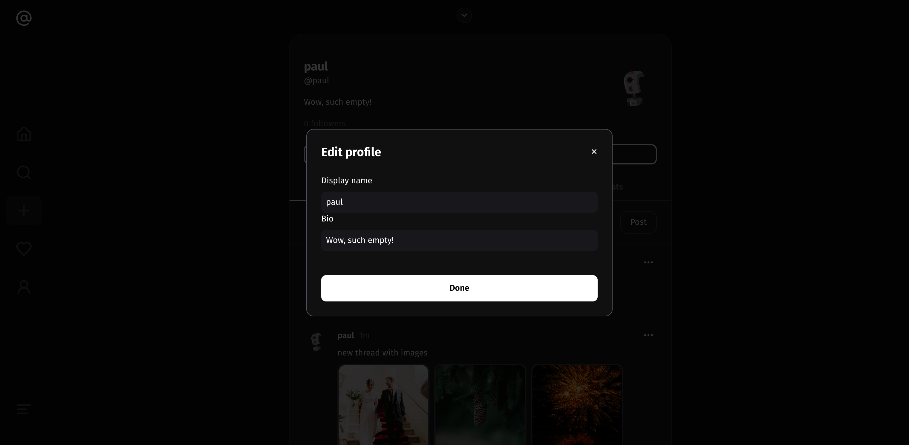

Created: Dec 8, 2024

<h1 align="center">Threads Clone</h1>

<p align="center">

</p>

<p align="center">
Simple Threads Clone with Remix and Drizzle
</p>

---

### Todo

- Zod validation on routes

### Stack

- Remix
- Drizzle
- Sqlite
- Uploadthing

### Installation

Fill in the .env file with the correct values.
then

```bash
# Install dependencies
npm install

# Create local.db
touch local.db

# Push schema to local.db
npx drizzle-kit push

# Run
npm run dev

# Open studio for database visualization
npx drizzle-kit studio
```

---

### Screenshots











#### Thoughts upon developing (probably irrelevant)

- Remix has a straightforward logic, only took me a few days to understand the concepts of Remix.

- Tried implementing proper html semantics and accessibility like aria-labels, etc.

- I like drizzle better than prisma.

- They kinda stick to web standards, so it's easy to understand.

- No middlewares, so we have to check for user session in every route for authorization.
  > https://remix.run/docs/en/1.19.3/pages/faq#how-can-i-have-a-parent-route-loader-validate-the-user-and-protect-all-child-routes
